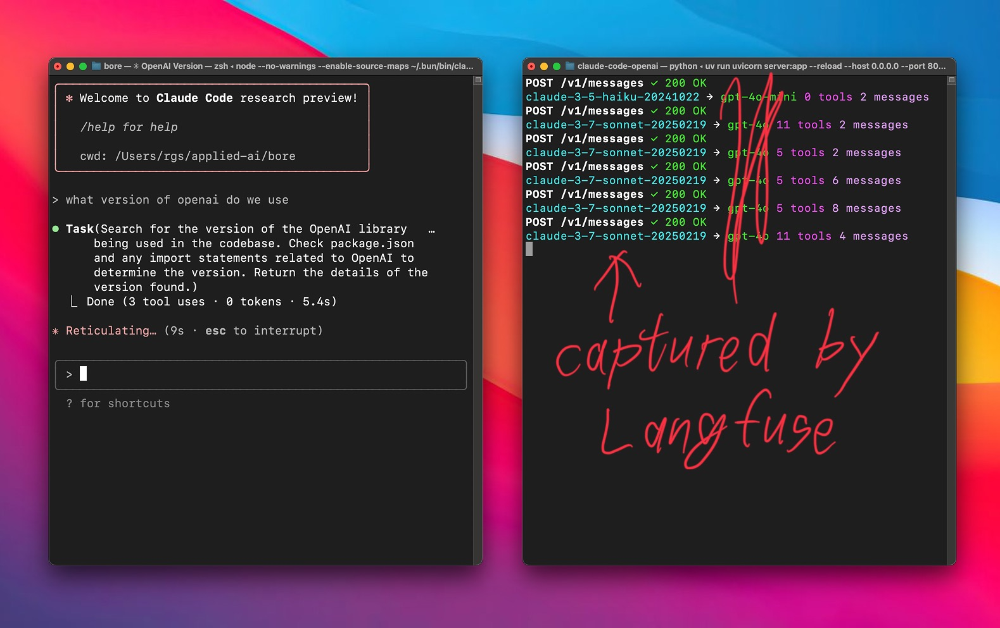

# Anthropic API Proxy (repurposed) 🔄

**A simple proxy server for Anthropic API using LiteLLM with Langfuse logging.** 🤝

A proxy server that accepts Anthropic API requests, forwards them through LiteLLM, and logs all interactions to Langfuse for observability and analytics. 🌉




## Quick Start ⚡

### Prerequisites

- Anthropic API key 🔑
- Langfuse account and API keys (for logging) 📊
- [uv](https://github.com/astral-sh/uv) installed.

### Setup 🛠️

1. **Clone this repository**:
   ```bash
   git clone https://github.com/teremterem/claude-code-openai.git
   cd claude-code-openai
   ```

2. **Install uv** (if you haven't already):
   ```bash
   curl -LsSf https://astral.sh/uv/install.sh | sh
   ```
   *(`uv` will handle dependencies based on `pyproject.toml` when you run the server)*

3. **Configure Environment Variables**:
   Create a `.env` file:
   ```bash
   touch .env
   ```
   Edit `.env` and add your API keys:
   ```dotenv
   ANTHROPIC_API_KEY=your-anthropic-api-key-here
   LANGFUSE_PUBLIC_KEY=your-langfuse-public-key
   LANGFUSE_SECRET_KEY=your-langfuse-secret-key
   LANGFUSE_HOST=https://cloud.langfuse.com
   ```

4. **Run the server**:
   ```bash
   uv run uvicorn server:app --host 0.0.0.0 --port 8082 --reload
   ```
   *(`--reload` is optional, for development)*

### Using with Claude Code 🎮

1. **Install Claude Code** (if you haven't already):
   ```bash
   npm install -g @anthropic-ai/claude-code
   ```

2. **Connect to your proxy**:
   ```bash
   ANTHROPIC_BASE_URL=http://localhost:8082 claude
   ```

3. **That's it!** Your Claude Code client will now use Anthropic models through the proxy. 🎯

## Supported Models

The proxy supports all Anthropic models available through LiteLLM, including:
- claude-3-5-sonnet-20241022
- claude-3-5-haiku-20241022
- claude-3-opus-20240229
- And other Anthropic models supported by LiteLLM

## How It Works 🧩

This proxy works by:

1. **Receiving requests** in Anthropic's API format 📥
2. **Converting** the requests to LiteLLM format 🔄
3. **Sending** the request to Anthropic via LiteLLM 📤
4. **Logging** all interactions to Langfuse for observability 📊
5. **Converting** the response back to Anthropic format 🔄
6. **Returning** the formatted response to the client ✅

The proxy handles both streaming and non-streaming responses, maintaining compatibility with all Claude clients while providing comprehensive logging and analytics through Langfuse. 🌊

## Langfuse Integration 📊

All API interactions are automatically logged to Langfuse, providing:
- Request/response tracking
- Performance metrics
- Usage analytics
- Error monitoring
- Token consumption tracking

Configure your Langfuse credentials in the `.env` file to enable logging.

## Contributing 🤝

Contributions are welcome! Please feel free to submit a Pull Request. 🎁
