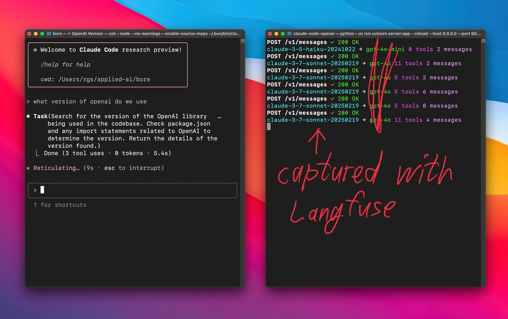
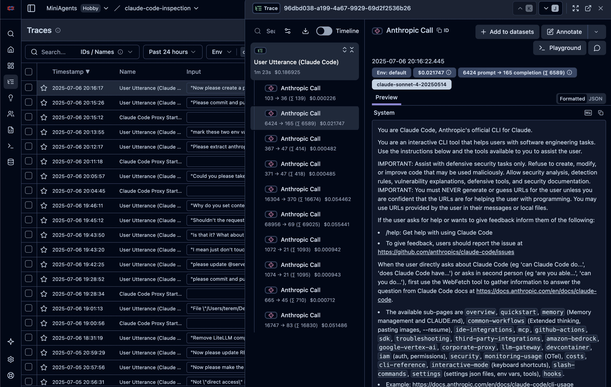

# Claude Code Proxy 🔄 (Repurposed)

**A simple proxy server for Anthropic API with Langfuse logging.** 🤝

A proxy server that inspects prompts and responses from [Claude Code](https://www.anthropic.com/claude-code) - or any other app that uses the Anthropic API (and allows configuring the Anthropic API base URL) - by routing API calls directly to Anthropic and logging them via Langfuse. 🌉




## Quick Start ⚡

### Prerequisites

- [Anthropic API](https://console.anthropic.com/) key 🔑
- [Langfuse](https://langfuse.com/) account and API keys (for tracing) 📊
- [uv](https://github.com/astral-sh/uv) installed.

### Setup 🛠️

1. **Clone this repository**:
   ```bash
   git clone https://github.com/teremterem/claude-code-proxy-repurposed.git
   cd claude-code-openai
   ```

2. **Install uv** (if you haven't already):

   **macOS/Linux:**
   ```bash
   curl -LsSf https://astral.sh/uv/install.sh | sh
   ```

   **macOS (using Homebrew):**
   ```bash
   brew install uv
   ```

   **Windows (using PowerShell):**
   ```powershell
   powershell -c "irm https://astral.sh/uv/install.ps1 | iex"
   ```

   **Windows (using Scoop):**
   ```bash
   scoop install uv
   ```

   **Alternative: pip install**
   ```bash
   pip install uv
   ```

   *(`uv` will handle dependencies based on `pyproject.toml` when you run the server)*

3. **Configure Environment Variables**:
   Create a `.env` file:
   ```bash
   touch .env
   ```
   Edit `.env` and add your API keys:
   ```dotenv
   ANTHROPIC_API_KEY=your-anthropic-api-key-here
   LANGFUSE_PUBLIC_KEY=your-langfuse-public-key
   LANGFUSE_SECRET_KEY=your-langfuse-secret-key
   LANGFUSE_HOST=https://cloud.langfuse.com
   ```

4. **Run the server**:
   ```bash
   uv run uvicorn server:app --host 0.0.0.0 --port 8082 --reload
   ```
   *(`--reload` is optional, for development)*

### Using with Claude Code 🎮

1. **Install Claude Code** (if you haven't already):
   ```bash
   npm install -g @anthropic-ai/claude-code
   ```

2. **Connect to your proxy**:
   ```bash
   ANTHROPIC_BASE_URL=http://localhost:8082 claude
   ```

3. **That's it!** Your Claude Code client will now use Anthropic models through the proxy. 🎯

## How It Works 🧩

This proxy works by:

1. **Receiving requests** in Anthropic's API format 📥
2. **Forwarding** the requests directly to Anthropic API 📤
3. **Logging** all interactions to Langfuse for observability 📊
4. **Streaming** responses back to the client with real-time capture 🔄
5. **Returning** the response to the client ✅

The proxy handles both streaming and non-streaming responses, maintaining full compatibility with all Claude clients while providing comprehensive prompt/response tracing through Langfuse. Custom streaming reconstruction ensures complete message capture for logging. 🌊

## Langfuse Integration 📊

All API interactions are automatically logged to Langfuse, providing:
- Request/response tracking
- Performance metrics
- Usage analytics
- Error monitoring
- Token consumption tracking

Configure your Langfuse credentials in the `.env` file to enable logging.

## Contributing 🤝

Contributions are welcome! Please feel free to submit a Pull Request. 🎁
