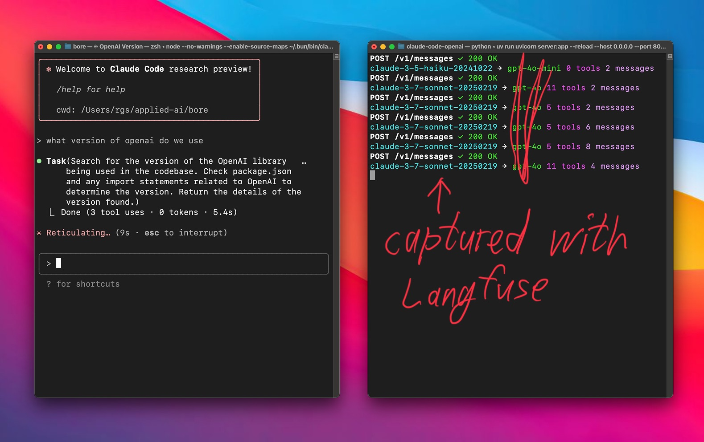

# Anthropic API Proxy 🔄 (Repurposed)

**A simple proxy server for Anthropic API with Langfuse logging.** 🤝

A proxy server for inspecting [Claude Code](https://www.anthropic.com/claude-code)'s prompts (and responses) by routing Anthropic API calls directly to Anthropic and logging them via Langfuse. 🌉



## Quick Start ⚡

### Prerequisites

- Anthropic API key 🔑
- [Langfuse](https://langfuse.com/) account and API keys (for logging) 📊
- [uv](https://github.com/astral-sh/uv) installed.

### Setup 🛠️

1. **Clone this repository**:
   ```bash
   git clone https://github.com/teremterem/claude-code-proxy-repurposed.git
   cd claude-code-openai
   ```

2. **Install uv** (if you haven't already):
   ```bash
   curl -LsSf https://astral.sh/uv/install.sh | sh
   ```
   *(`uv` will handle dependencies based on `pyproject.toml` when you run the server)*

3. **Configure Environment Variables** (Optional):
   Create a `.env` file:
   ```bash
   touch .env
   ```
   Edit `.env` and add your API keys:
   ```dotenv
   # Optional: Set API key here, or provide it in requests
   ANTHROPIC_API_KEY=your-anthropic-api-key-here
   
   # Optional: For Langfuse logging
   LANGFUSE_PUBLIC_KEY=your-langfuse-public-key
   LANGFUSE_SECRET_KEY=your-langfuse-secret-key
   LANGFUSE_HOST=https://cloud.langfuse.com
   ```
   
   **Note**: If `ANTHROPIC_API_KEY` is not set, the proxy will use the API key from:
   - The `api_key` field in the request body, or
   - The `Authorization: Bearer <token>` header

4. **Run the server**:
   ```bash
   uv run uvicorn server:app --host 0.0.0.0 --port 8082 --reload
   ```
   *(`--reload` is optional, for development)*

### Using with Claude Code 🎮

1. **Install Claude Code** (if you haven't already):
   ```bash
   npm install -g @anthropic-ai/claude-code
   ```

2. **Connect to your proxy**:
   ```bash
   ANTHROPIC_BASE_URL=http://localhost:8082 claude
   ```

3. **That's it!** Your Claude Code client will now use Anthropic models through the proxy. 🎯

## Supported Models

The proxy supports all Anthropic models available through the official Anthropic API, including:
- claude-3-5-sonnet-20241022
- claude-3-5-haiku-20241022
- claude-3-opus-20240229
- And other Anthropic models supported by the official API

## How It Works 🧩

This proxy works by:

1. **Receiving requests** in Anthropic's API format 📥
2. **Extracting API key** from environment, request body, or Authorization header 🔑
3. **Sending** the request directly to Anthropic API 📤
4. **Logging** all interactions to Langfuse for observability 📊
5. **Returning** the response to the client ✅

The proxy handles both streaming and non-streaming responses, maintaining full compatibility with all Claude clients while providing comprehensive logging and analytics through Langfuse. 🌊

## Langfuse Integration 📊

All API interactions are automatically logged to Langfuse, providing:
- Request/response tracking
- Performance metrics
- Usage analytics
- Error monitoring
- Token consumption tracking

Configure your Langfuse credentials in the `.env` file to enable logging.

## API Key Authentication 🔐

The proxy supports flexible API key authentication with multiple methods:

### Priority Order
1. **Environment Variable** (highest priority): `ANTHROPIC_API_KEY` in `.env`
2. **Request Body**: `api_key` field in the JSON request
3. **Authorization Header**: `Authorization: Bearer <your-api-key>`

### Usage Examples

**With Environment Variable:**
```bash
# Set in .env file
ANTHROPIC_API_KEY=your-key-here

# Use with Claude Code
ANTHROPIC_BASE_URL=http://localhost:8082 claude
```

**With Authorization Header:**
```bash
# Use with Claude Code (no env variable needed)
ANTHROPIC_BASE_URL=http://localhost:8082 ANTHROPIC_API_KEY=your-key-here claude
```

**With Request Body:**
```bash
curl -X POST http://localhost:8082/v1/messages \
  -H "Content-Type: application/json" \
  -d '{
    "model": "claude-3-5-sonnet-20241022",
    "api_key": "your-key-here",
    "messages": [{"role": "user", "content": "Hello!"}]
  }'
```

## Contributing 🤝

Contributions are welcome! Please feel free to submit a Pull Request. 🎁
